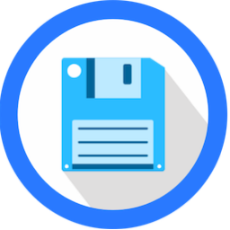

  

# File Browser for StartOS

[File Browser](https://github.com/filebrowser/filebrowser) provides a simple file managing interface which can be used to upload, download, organize, edit, and share your files. It allows the creation of multiple users and each user can have their own directory. This repository creates the `s9pk` package that is installed to run File Browser on [StartOS](https://github.com/Start9Labs/start-os/).

## Setup

Follow the documentation [guides](https://staging.docs.start9.com/packaging-guide/environment-setup.html).
